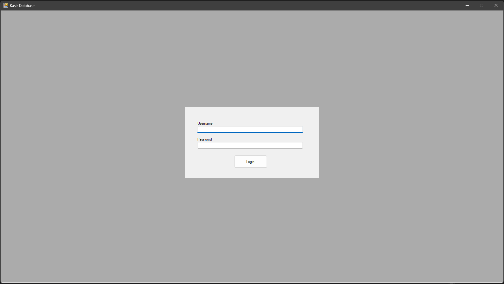
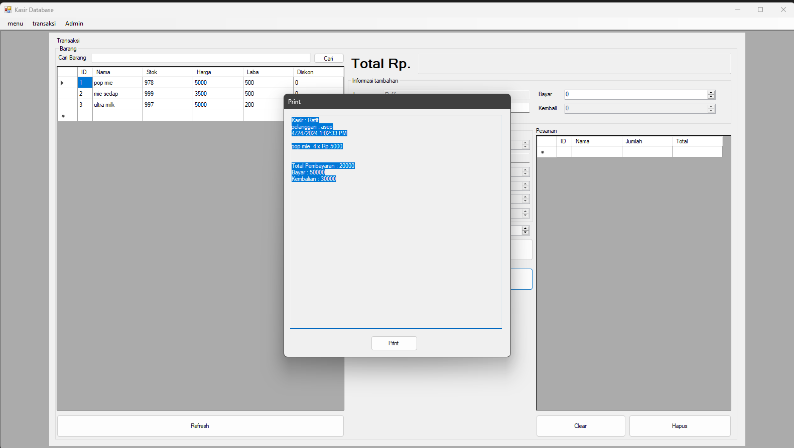
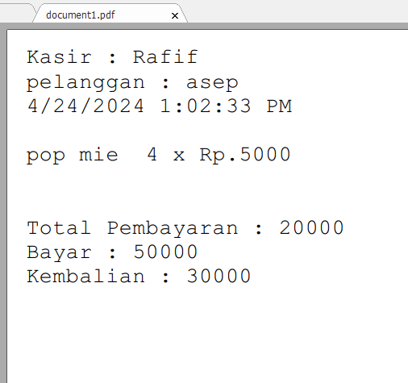
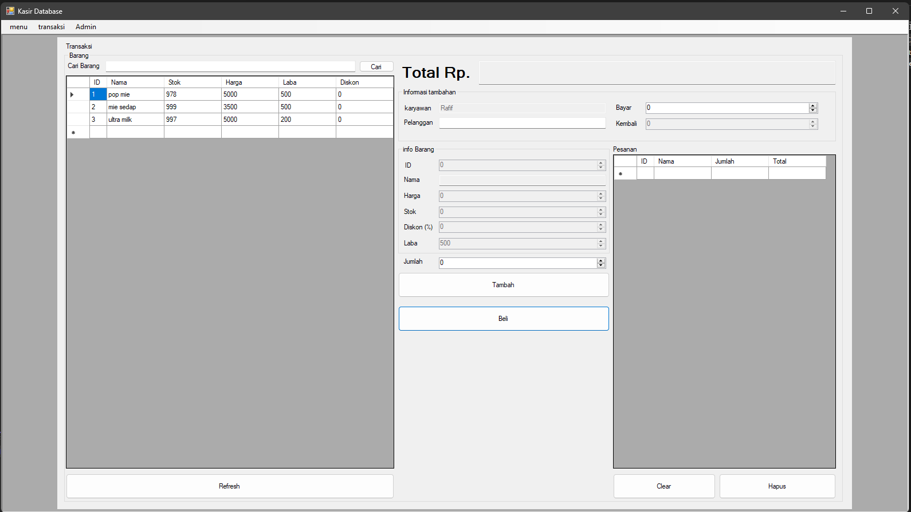
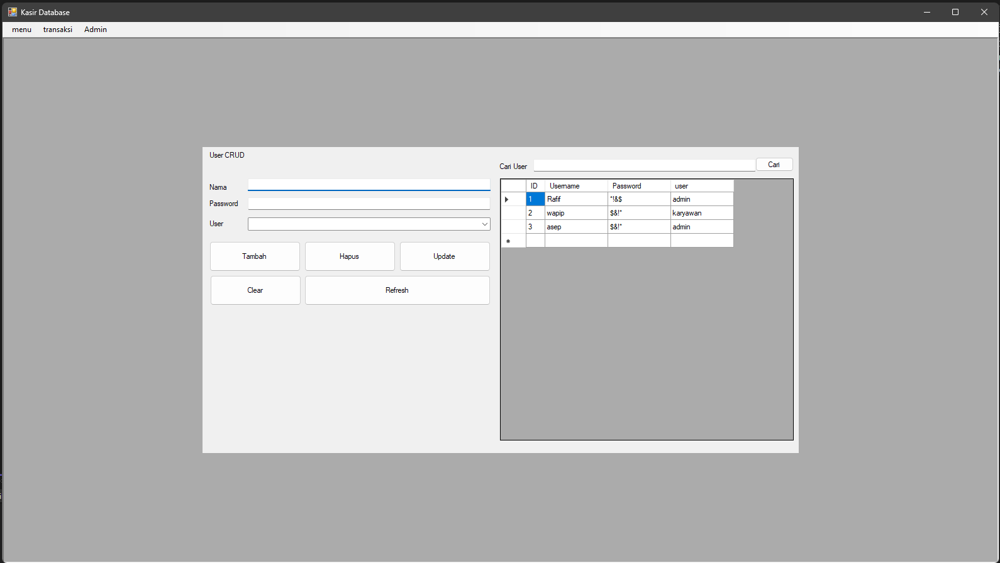
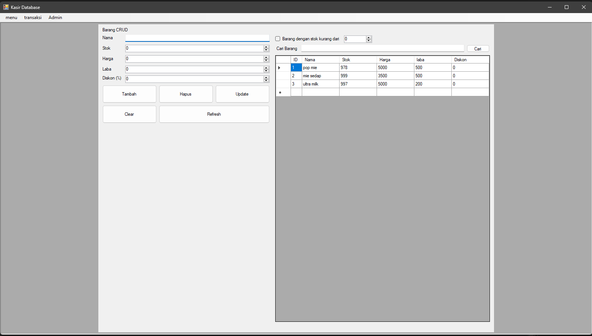
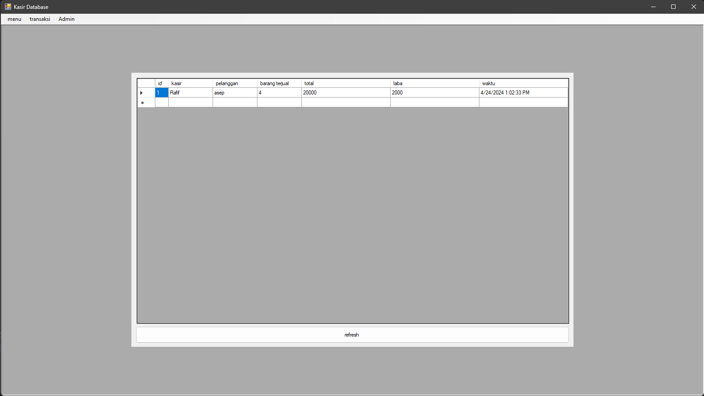
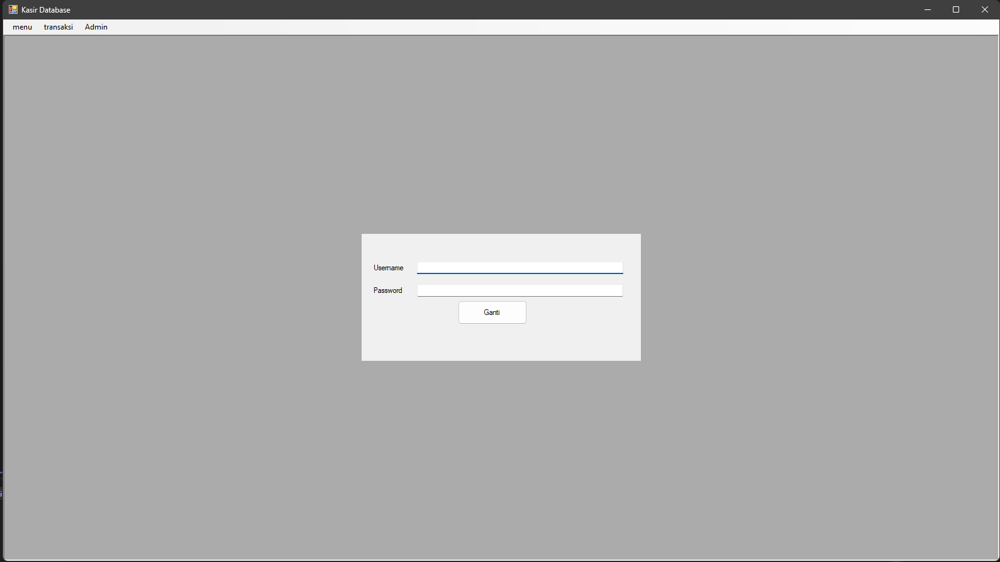
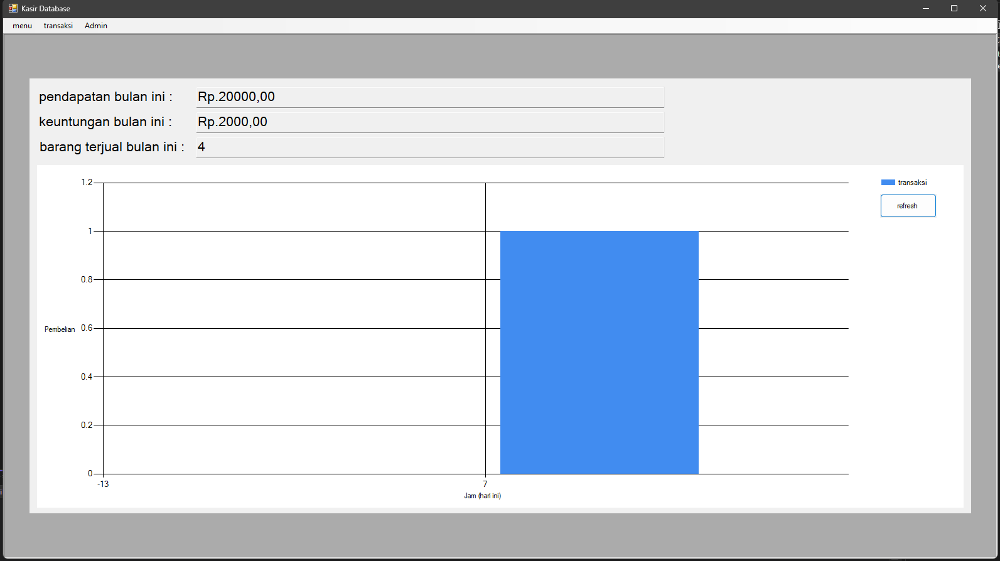

# Cash register

Aplikasi Dekstop ini dibuat untuk memenuhi Portofolio saya, aplikasi ini default jadi bisa di gunakan siapa saja bahkan selain Cafe. Aplikasi ini dibuat dengan bahasa C# dan database SQL.

Aplikasi ini memiliki fitur :
- Database SQL (file tersedia di atas)
- Enkripsi dan Deskripsi Password
- Diagram batang jumlah transaksi pembelian/jam/hari
- terdapat mode Karyawan dan Admin (User apk ini hanya karyawan dari perusahaan tersebut)
- transaksi
- rekap data transaksi (terhapus otomatis setiap satu bulan)
- fitur search

User : 
- Rafif ,pw = 4321 (Admin)

Install :
- Download semua file
- Impor kasir (1) ke SQL di Xampp
- kasir_pro_database.application

